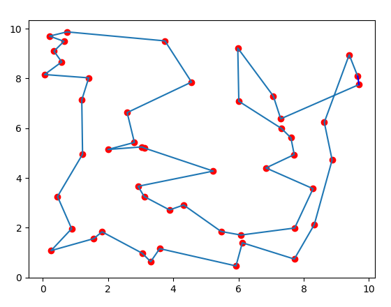
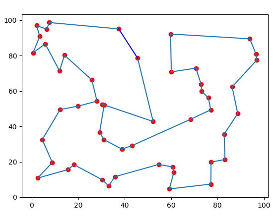
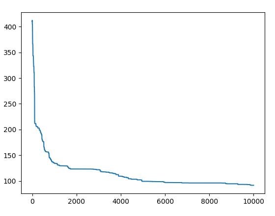
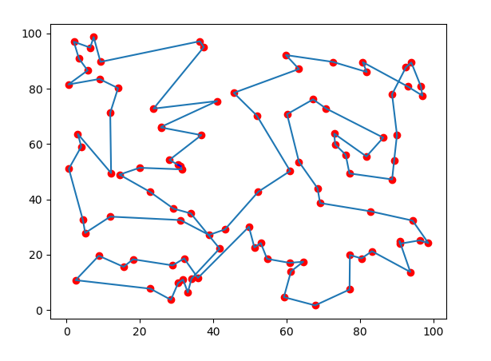
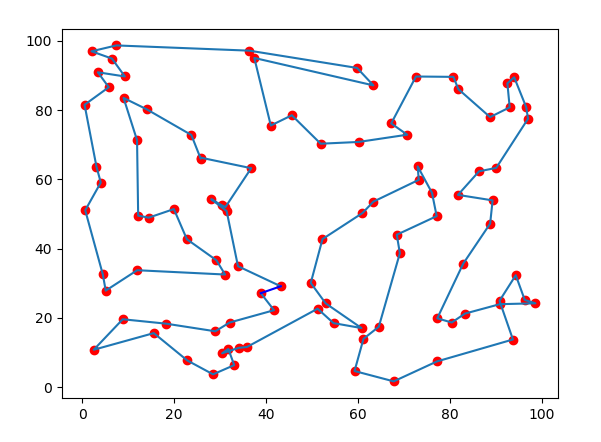
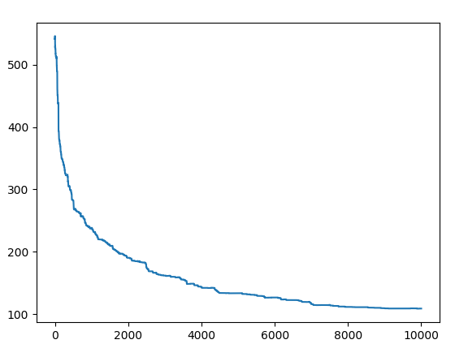

# Simulated annealing to solve travelling salesman problem

The [travelling salesman problem](https://en.wikipedia.org/wiki/Travelling_salesman_problem) (TSP) asks the following question: "Given a list of cities and the distances between each pair of cities, what is the shortest possible route that visits each city and returns to the origin city?" It is an NP-hard problem in combinatorial optimization, important in theoretical computer science and operations research. 

## 50 cities
### Solutions for 50 random generated cities:

    
    

## The length of whole root through iterations

## 100 cities
### Solutions for 100 random generated cities:

    
    

## The length of whole root through iterations
